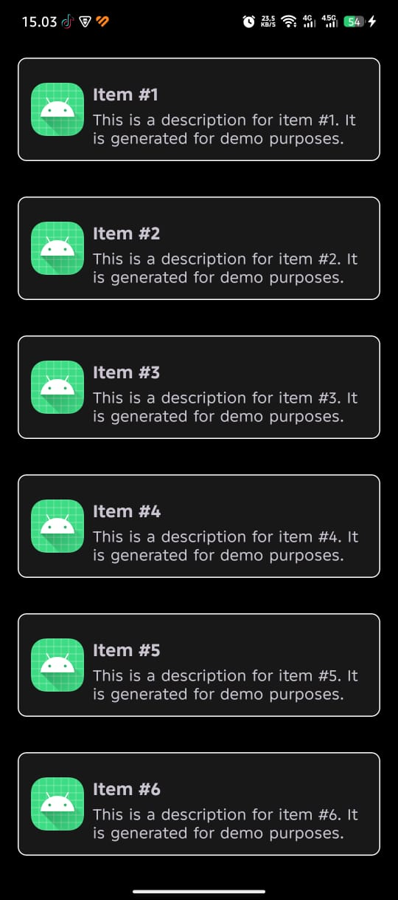
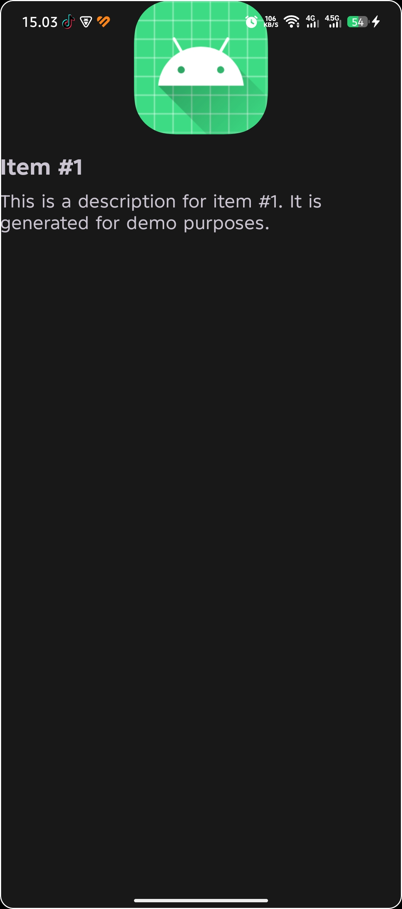

# RecyclerViewApp

A simple Android application that showcases a **RecyclerView** with a list of dummy items displayed using custom card layouts. The app demonstrates:

- **RecyclerView** with `ListAdapter` for efficient list handling
- **ViewBinding** for type‑safe view access
- Dark mode forced across the app
- Item spacing via a custom `ItemDecoration`
- Navigation to a detail screen on item click

---

## Screenshots

<!-- Replace the placeholders below with actual screenshots -->

| Main Screen | Detail Screen |
|-------------|--------------|
|  |  |

---

## Features

- Generates a configurable number of dummy items (currently 150)
- Uses `LinearLayoutManager` for vertical scrolling
- Supports dark theme (`MODE_NIGHT_YES`)
- Clean separation of concerns: data model (`Item`), adapter (`ItemAdapter`), and UI (`MainActivity`, `DetailActivity`)

---

## Project Structure

```
app/
 ├─ src/main/java/com/example/recyclerviewapp/
 │   ├─ MainActivity.kt          # Hosts the RecyclerView
 │   ├─ DetailActivity.kt        # Shows item details
 │   ├─ ItemAdapter.kt           # ListAdapter implementation
 │   ├─ Item.kt                  # Data class for list items
 │   ├─ DummyDataProvider.kt     # Generates dummy data
 │   └─ SpacingItemDecoration.kt # Adds spacing between cards
 └─ src/main/res/layout/
     ├─ activity_main.xml        # Layout with RecyclerView
     ├─ activity_detail.xml      # Layout for detail view
     └─ item_card.xml            # Card layout for each list item
```

---

## Build & Run

The project uses the Gradle wrapper. Ensure you have the Android SDK installed and `local.properties` points to it.

```bash
# Assemble a debug APK
./gradlew assembleDebug

# Install and launch on a connected device or emulator
./gradlew installDebug
```

Run unit tests:

```bash
./gradlew test
```

Run instrumented UI tests (requires a device/emulator):

```bash
./gradlew connectedAndroidTest
```

---

## License

This project is provided for educational purposes. Feel free to fork, modify, and use it in your own learning projects.
